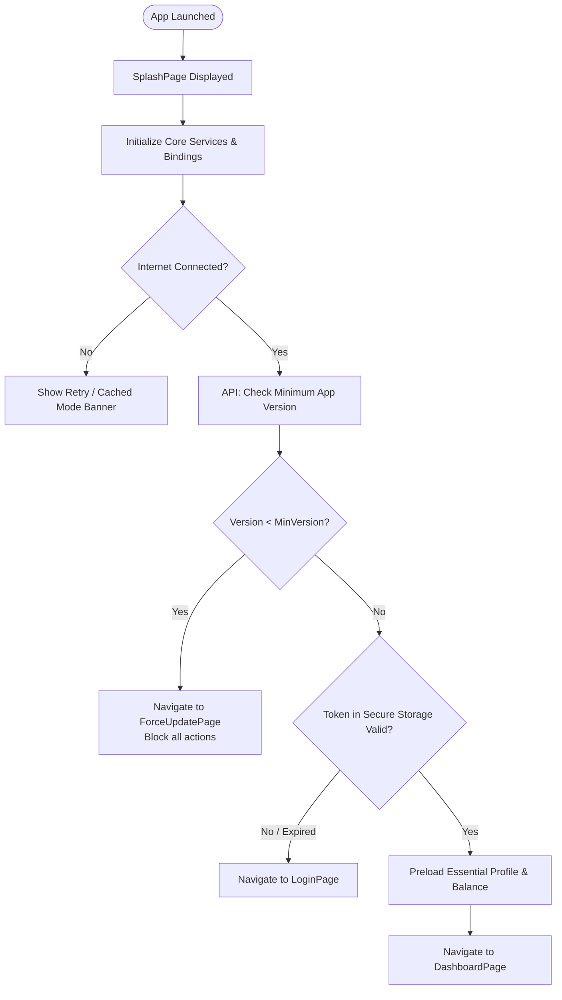

# Somobay Somiti Mobile App — Navigation & Routing Architecture

## 1. Routing Strategy & GetX Route Configuration

The application uses named routing managed entirely by GetX `AppPages` and `AppRoutes`. All pages are lazily instantiated with their respective `Bindings` to ensure memory efficiency.

---

## 2. Complete Page & Route Registry

| # | Page Name | Purpose | Route Name (`AppRoutes.*`) | Controller | Repository | Primary Model | Binding | Navigation From | Navigation To |
|---|---|---|---|---|---|---|---|---|---|
| 1 | `SplashPage` | App boot, version check & session routing | `/splash` | `SplashController` | `SplashRepository` | `AppVersionModel` | `SplashBinding` | App Launch | `/login`, `/dashboard`, `/force-update` |
| 2 | `ForceUpdatePage` | Mandates app upgrade when version is deprecated | `/force-update` | `SplashController` | - | `AppVersionModel` | `SplashBinding` | `/splash` | External Store (Play Store/App Store) |
| 3 | `LoginPage` | Member login via phone number & password / PIN | `/login` | `LoginController` | `AuthRepository` | `LoginRequestModel`, `AuthTokenModel` | `LoginBinding` | `/splash`, `/register`, Logout | `/dashboard`, `/forgot-password`, `/register` |
| 4 | `RegisterPage` | New member admission request submission | `/register` | `RegisterController` | `AuthRepository` | `RegisterRequestModel` | `RegisterBinding` | `/login` | `/otp-verification` |
| 5 | `ForgotPasswordPage` | Account password recovery initiation | `/forgot-password` | `ForgotPasswordController` | `AuthRepository` | `ResetPasswordModel` | `ForgotPasswordBinding` | `/login` | `/otp-verification` |
| 6 | `OtpVerificationPage` | 4/6-digit SMS OTP verification | `/otp-verification` | `OtpController` | `AuthRepository` | `OtpVerifyModel` | `OtpBinding` | `/register`, `/forgot-password` | `/login`, `/change-password` |
| 7 | `DashboardPage` | Bottom navigation shell with indexed stack tabs | `/dashboard` | `DashboardController` | - | - | `DashboardBinding` | `/login`, `/splash` | Nested tabs (Home, Savings, Loans, Passbook, Profile) |
| 8 | `HomePage` | Executive financial summary, notices & quick actions | `/dashboard/home` (Tab 0) | `HomeController` | `HomeRepository` | `SomitiSummaryModel` | `HomeBinding` | Tab 0 | `/savings/details`, `/loans/details`, `/notifications`, `/members` |
| 9 | `SavingsListPage` | List of general savings, DPS, and fixed deposits | `/dashboard/savings` (Tab 1) | `SavingsController` | `SavingsRepository` | `SavingsAccountModel` | `SavingsBinding` | Tab 1, `/dashboard/home` | `/savings/details`, `/savings/deposit` |
| 10 | `SavingsDetailsPage` | Transaction history, interest accrued & schedule of DPS/Savings | `/savings/details` | `SavingsDetailsController` | `SavingsRepository` | `SavingsDetailModel` | `SavingsBinding` | `/dashboard/savings` | `/savings/deposit`, `/transactions/details` |
| 11 | `NewDepositPage` | Pay monthly installment / deposit into savings | `/savings/deposit` | `DepositController` | `SavingsRepository` | `DepositRequestModel` | `SavingsBinding` | `/savings/details`, `/dashboard/home` | `/transactions/details`, `/dashboard` |
| 12 | `LoanListPage` | Active, pending & completed loan schemes | `/dashboard/loans` (Tab 2) | `LoanController` | `LoanRepository` | `LoanAccountModel` | `LoanBinding` | Tab 2, `/dashboard/home` | `/loans/details`, `/loans/calculator`, `/loans/repay` |
| 13 | `LoanDetailsPage` | Loan breakdown, EMI installment calendar & penalty terms | `/loans/details` | `LoanDetailsController` | `LoanRepository` | `LoanDetailModel` | `LoanBinding` | `/dashboard/loans` | `/loans/repay` |
| 14 | `LoanCalculatorPage` | EMI & interest simulator for cooperative members | `/loans/calculator` | `LoanCalculatorController` | `LoanRepository` | `LoanCalculationResult` | `LoanBinding` | `/dashboard/loans`, `/dashboard/home` | - |
| 15 | `LoanRepaymentPage` | Installment payment gateway / manual receipt submission | `/loans/repay` | `LoanRepaymentController` | `LoanRepository` | `LoanRepayRequestModel` | `LoanBinding` | `/loans/details` | `/dashboard` |
| 16 | `ShareOverviewPage` | Total share capital, share certificates & dividends | `/share-capital` | `ShareController` | `ShareRepository` | `ShareAccountModel` | `ShareBinding` | `/dashboard/home`, `/profile` | `/share-capital/transactions` |
| 17 | `MemberList` | Somiti members directory with phone & role | `/members` | `MemberController` | `MemberRepository` | `MemberModel` | `MemberBinding` | `/dashboard/home`, `/profile` | `/members/details` |
| 18 | `MemberDetailsPage` | Detailed member profile, share count & guarantor history | `/members/details` | `MemberDetailsController` | `MemberRepository` | `MemberDetailModel` | `MemberBinding` | `/members` | - |
| 19 | `TransactionHistoryPage` | Digital passbook with credit/debit filter & export | `/dashboard/transactions` (Tab 3) | `TransactionController` | `TransactionRepository` | `TransactionModel` | `TransactionBinding` | Tab 3, `/dashboard/home` | `/transactions/details` |
| 20 | `TransactionDetailsPage` | Digital receipt / voucher with shareable slip | `/transactions/details` | `TransactionDetailsController` | `TransactionRepository` | `TransactionModel` | `TransactionBinding` | `/dashboard/transactions`, `/savings/details` | Export PDF / Share |
| 21 | `NotificationPage` | Official somiti notices, meetings & alerts | `/notifications` | `NotificationController` | `NotificationRepository` | `NotificationItemModel` | `NotificationBinding` | AppBar Icon on all tabs | Notice full view |
| 22 | `ProfilePage` | Member profile, somiti rules, language toggle & security | `/dashboard/profile` (Tab 4) | `ProfileController` | `ProfileRepository` | `UserProfileModel` | `ProfileBinding` | Tab 4 | `/profile/edit`, `/profile/language`, `/profile/change-password`, `/profile/somiti-info` |
| 23 | `EditProfilePage` | Update contact address, nominee info & profile photo | `/profile/edit` | `EditProfileController` | `ProfileRepository` | `UserProfileModel` | `ProfileBinding` | `/dashboard/profile` | `/dashboard/profile` |
| 24 | `LanguageSelectionPage` | Switch between বাংলা (Bangla) and English | `/profile/language` | `LanguageController` | `StorageService` | `LocaleModel` | `ProfileBinding` | `/dashboard/profile` | Back |
| 25 | `ChangePasswordPage` | Update account password or security PIN | `/profile/change-password` | `ChangePasswordController` | `ProfileRepository` | `ChangePasswordModel` | `ProfileBinding` | `/dashboard/profile` | `/dashboard/profile` |
| 26 | `SomitiInfoPage` | Cooperative registration number, by-laws & committee list | `/profile/somiti-info` | `SomitiInfoController` | `HomeRepository` | `SomitiInfoModel` | `ProfileBinding` | `/dashboard/profile` | - |

---

## 3. Bottom Navigation Structure

The Bottom Navigation is wrapped inside `DashboardPage` using an `IndexedStack` to preserve the state of individual tabs when switching, preventing unnecessary API reload cycles.

```
+-------------------------------------------------------------------------------+
|                               Active Tab Page View                            |
+-------------------------------------------------------------------------------+
| [Tab 0: Home] | [Tab 1: Savings] | [Tab 2: Loans] | [Tab 3: Passbook] | [Tab 4: Profile] |
+-------------------------------------------------------------------------------+
```

### Tab Configuration:
- **Tab 0:** `Home` (`ic_home`) — Label: `home`.tr (হোম / Home)
- **Tab 1:** `Savings` (`ic_savings`) — Label: `savings`.tr (সঞ্চয় ও ডিপিএস / Savings)
- **Tab 2:** `Loans` (`ic_loan`) — Label: `loans`.tr (ঋণ কার্যক্রম / Loans)
- **Tab 3:** `Passbook` (`ic_ledger`) — Label: `passbook`.tr (লেনদেন বই / Passbook)
- **Tab 4:** `Profile` (`ic_profile`) — Label: `profile`.tr (প্রোফাইল / Profile)

---

## 4. Application Startup & Route Decision Flow


